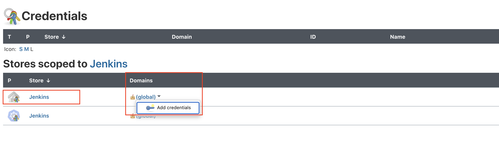

# Deploy Jenkins

Jenkins will be the CI/CD pipeline tool of choice for this workshop. We'll deploy Jenkins as a Kubernetes service and use persistent volumes for the workspace and jobs directory, so that these data is persisted, if the pod is restarted. Jenkins will subsequentially start a pod for each build that is triggered. To save bandwidth, we create one more persistent volume that acts as a maven cache volume and is mounted automatically in each pod that runs a maven build.

## Data needed

* creds.json file populated

## Setup all the namespaces, databases and RabbitMQ executing the following command:

In this lab, we'll also prepare the `dev`, `staging`, and `production` namespaces in Kubernetes, so that the services find the infrastructure components that they need to work properly, i.e. the databases for certain services, and RabbitMQ. 

```bash
(bastion)$ kubectl create -f repositories/sockshop-infrastructure/manifests/
```

Verify the deployments have been successful in each of the namespaces using the following command

```bash
(bastion)$ kubectl get deployment --all-namespaces | grep 'db\|rabbit'
```

## Auto install or manual

In order to have this step go faster, an automatic installation option has been provided. This will take the information that was provided earlier and stored in the creds.json file and use that to install and configure Jenkins. For a more verbose experience, a manual installation option is also available.

* [Auto Installation](#auto-installation)
* [Manual Installation](./jenkins-manual-installation.md)

## Auto Installation

1. To install Jenkins automatically, it suffices to execute the following on the bastion host

```bash
(bastion)$ cd
(bastion)$ ./deployJenkins.sh
```

1. This script will take the values that are required to install Jenkins and use `sed` to copy them into the Kubernetes Deployment specificator as environment variables. The following will be applied:
    - your Gitea organization
    - the email address of your Gitea user
    - the IP address of the Docker registry we've deployed in the previous step
    - the Dynatrace tenant URL
    - an API Token form your Dynatrace tenant.

## Confirm Jenkins configuration

1. Find the IP for Jenkins by retrieving the `jenkins` service which was deployed:

```bash
(bastion)$ kubectl -n cicd get svc jenkins
```

1. Open the `Jenkins URL` in your browser and login with the following credentials:
    * username: *admin*
    * password: *dynatrace*

    

1. After logging in, you will be presented with the Jenkins UI with the preconfigured build pipelines for the Sockshop projects.

    

1. For later use we configure Gitea credentials in Jenkins, so that selected pipelines can commit commit to Gitea with the provided credentials. On the Jenkins UI home screen Click "Manage Jenkins" :one: and then click on "Manage Credentials" :two: under the Security settings, then the small black arrow next to "global" on the Jenkins credential provider, that shows when you put the mouse cursor over "global" :two:. Finally, click "Add credentials :three:.
    
    

1. Provide your Gitea username :one:, your `Personal Access token` (get this from `creds.json` file on your bastion host, use the 'cat' or 'vi' command to view) :two:, and the ID :three:.
    **It's important to use this ID `git-credentials-acm`, as the credentials are referenced by this ID by selected builds.** To save the credentials click OK :four:.

---

[Previous Step: Deploy Gitea](../2_Deploy_Gitea) :arrow_backward: :arrow_forward: [Next Step: Trigger Build Pipeline](../4_Trigger_Build_Pipelines)

:arrow_up_small: [Back to overview](../)
