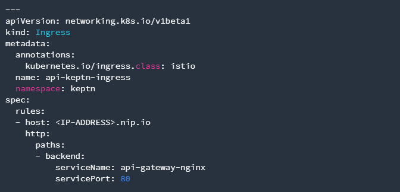

# Configure istio and Monitoring for keptn

In this lab you'll configure Dynatrace and Prometheus monitoring for keptn

## Step 1: Configure Istio

1. The first step for our configuration automation for Istio is downloading the configuration bash script from Github:
    ```bash
    (bastion)$ curl -o configure-istio.sh https://raw.githubusercontent.com/keptn/examples/release-0.7.1/istio-configuration/configure-istio.sh
    ```
2. After that you need to make the file executable using the chmod command.
    ```bash
    (bastion)$ chmod +x configure-istio.sh
    ```
3. Finally, let's run the configuration script to automatically create your Ingress resources.
    ```bash
    (bastion)$ ./configure-istio.sh
    ```
#### What is actually created
With this script, you have created an Ingress based on the following manifest.

Besides, the script has created a gateway resource for you so that the onboarded services are also available publicly.


## Step 2: Authenticate keptn API

1. Create Keptn API and Endpoint Token Environment Variables
    ```bash
    (bastion)$ KEPTN_ENDPOINT=http://$(kubectl -n keptn get ingress api-keptn-ingress -ojsonpath='{.spec.rules[0].host}')/api
    (bastion)$ KEPTN_API_TOKEN=$(kubectl get secret keptn-api-token -n keptn -ojsonpath='{.data.keptn-api-token}' | base64 --decode)
    ```
2. Use this stored information and authenticate the CLI.
    ```bash
    (bastion)$ keptn auth --endpoint=$KEPTN_ENDPOINT --api-token=$KEPTN_API_TOKEN
    ```
3. If you want, you can go ahead and take a look at the Keptn API by navigating to the endpoint that is given via
    ```bash
    (bastion)$ echo $KEPTN_ENDPOINT
    ```

## Step 3: Configure the Dynatrace Service for keptn

The OneAgent Operator has already been deployed in earlier stages of the lab. However, we still need to install the Dynatrace Service for keptn which will allow keptn to communicate with Dynatrace for sending events and comments to Problems

1. Execute the following command from your home directory to install the Dynatrace Service for keptn

    ```bash
    (bastion)$ cd
    (bastion)$ ./installDynatraceServiceForKeptn.sh
    ```

1. This script will perform the following steps:
    - Configure automated tagging rules in Dynatrace for environment, service and test-subject
    - Configure a problem notification in Dynatrace for sending events to the keptn api
    - Set up the Dynatrace Service in keptn

---

[Previous Step: Install keptn](../01_Install_keptn) :arrow_backward: :arrow_forward: [Next Step: Onboard a Service](../03_Onboard_Service)

:arrow_up_small: [Back to overview](../)
