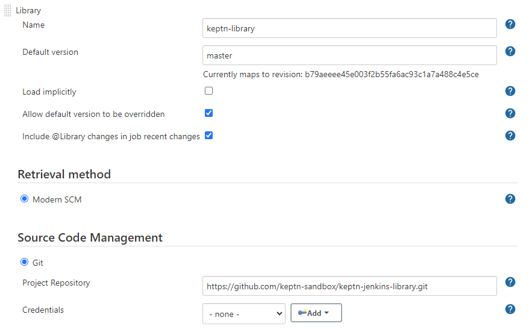

# Configure Keptn library for Jenkins
In this lab you'll learn how to configure the Keptn library for Jenkins.

## Step 1: Review keptn library installation
Go into Jenkins and review the [keptn library](https://github.com/keptn-sandbox/keptn-jenkins-library.git) installation `Jenkins > Manage Jenkins > Configure System >Global Pipeline Libraries`.

