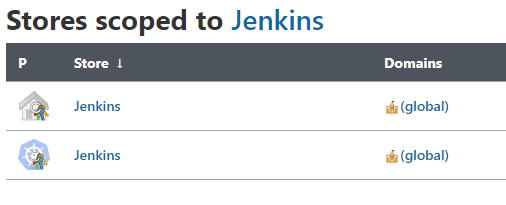
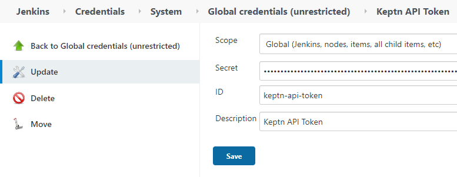
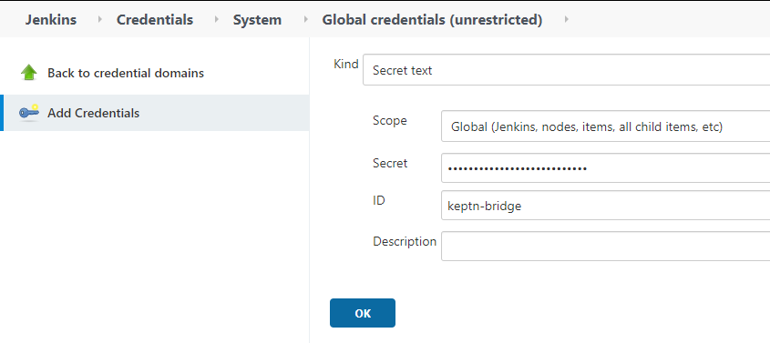
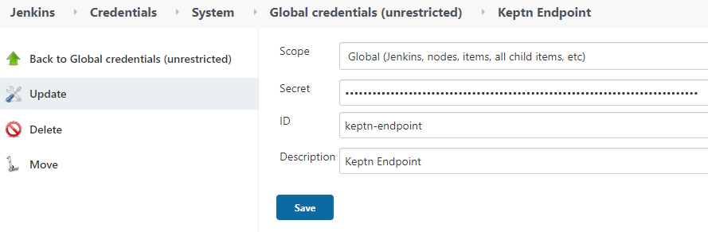

# Configure Keptn library for Jenkins
In this lab you'll learn how to configure the Keptn library for Jenkins.


## Step 1: Review Keptn library installation
Go into Jenkins and review the [keptn library](https://github.com/keptn-sandbox/keptn-jenkins-library.git) installation `Jenkins > Manage Jenkins > Configure System > Global Pipeline Libraries`.


## Step 2: Get Keptn credentials

Retrieve the Keptn credentials using the following

```
(bastion)$ export KEPTN_API_TOKEN=$(kubectl get secret keptn-api-token -n keptn -ojsonpath={.data.keptn-api-token} | base64 --decode)
(bastion)$ echo $KEPTN_API_TOKEN
(bastion)$ export KEPTN_BRIDGE=http://$(kubectl -n keptn get service api-gateway-nginx -ojsonpath='{.status.loadBalancer.ingress[0].ip}')/bridge
(bastion)$ echo $KEPTN_BRIDGE
(bastion)$ export KEPTN_ENDPOINT=http://$(kubectl -n keptn get service api-gateway-nginx -ojsonpath='{.status.loadBalancer.ingress[0].ip}')/api
(bastion)$ echo $KEPTN_ENDPOINT
```

## Step 3: Store Keptn credentials in Jenkins

 Inside Jenkins go into `Manage Jenkins > Manage credentials ` and select the first element with the house icon.

Then click `Global credentials > Add credentials` and store the values from step 2.Repeat the process for each variable.





[Previous Step: Configure Keptn & Dynatrace integration](../02_Configure_Keptn_Dynatrace_Integration) :arrow_backward: :arrow_forward: [Next Step: Define Request Attributes](../04_Define_Request_Attributes)

:arrow_up_small: [Back to overview](../)
