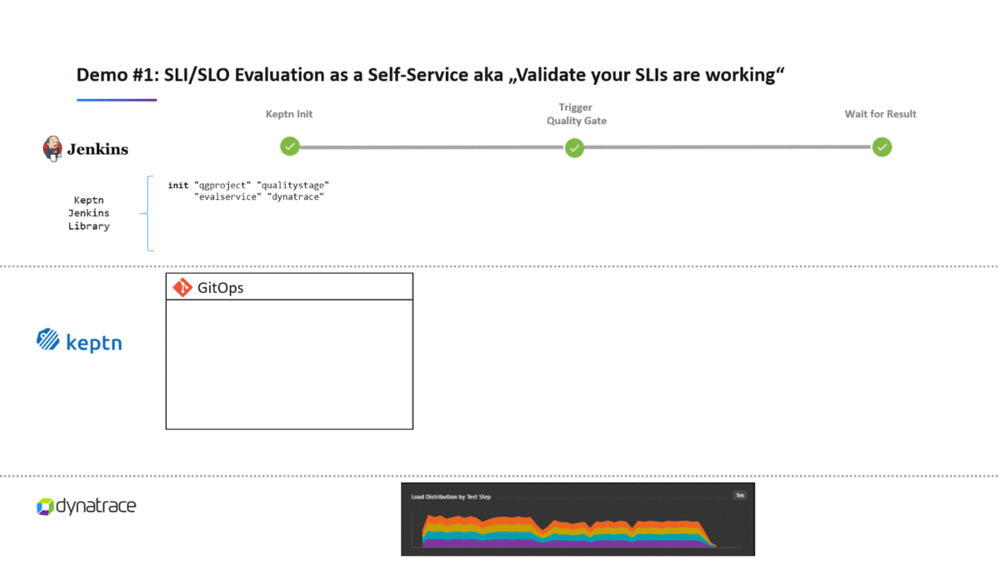

# Configure Keptn library for Jenkins
In this lab you'll learn how to configure the Keptn library for Jenkins.


## Step 1: Review keptn library installation
Go into Jenkins and review the [keptn library](https://github.com/keptn-sandbox/keptn-jenkins-library.git) installation `Jenkins > Manage Jenkins > Configure System >Global Pipeline Libraries`.


## Step 2: Set the keptn variables inside Jenkins

You can retrieve the variables set in the last lab using

```
(bastion)$ export KEPTN_API_TOKEN=$(kubectl get secret keptn-api-token -n keptn -ojsonpath={.data.keptn-api-token} | base64 --decode)
(bastion)$ echo $KEPTN_API_TOKEN
(bastion)$ export KEPTN_BRIDGE=http://$(kubectl -n keptn get service api-gateway-nginx -ojsonpath='{.status.loadBalancer.ingress[0].ip}')/bridge
(bastion)$ echo $KEPTN_BRIDGE
(bastion)$ export KEPTN_ENDPOINT=http://$(kubectl -n keptn get service api-gateway-nginx -ojsonpath='{.status.loadBalancer.ingress[0].ip}')/api
(bastion)$ echo $KEPTN_ENDPOINT
```

Then inside Jenkins go into Manage `Jenkins > Configure System > Global properties` a set the variables values.


