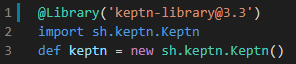

# Configure Keptn library for Jenkins
In this lab you'll learn how to configure the Keptn library for Jenkins.


## Step 1: Review keptn library installation
Go into Jenkins and review the [keptn library](https://github.com/keptn-sandbox/keptn-jenkins-library.git) installation `Jenkins > Manage Jenkins > Configure System >Global Pipeline Libraries`.


## Step 2: Review the pipeline and copy the changes

Review the pipeline definition file located in the repository `carts/Jenkinsfile.complete.performance`. 



To activate the pipeline copy content of `carts/Jenkinsfile.complete.performance` into `carts/Jenkinsfile.complete` and commit the changes.

## Step 3: Review the SLI,SLO definitions

Go into `carts\keptn` folder and review the files used to define the SLO. You can find more information about SLO definitions [here](https://keptn.sh/docs/0.7.x/quality_gates/slo/)

```
---
spec_version: "0.1.1"
comparison:
  aggregate_function: "avg"
  compare_with: "single_result"
  include_result_with_score: "pass"
filter:
objectives:
  - sli: "response_time_p95"
    key_sli: false
    pass:             # pass if (relative change <= 10% AND absolute value is < 800ms)
      - criteria:
          - "<=+10%"  # relative values require a prefixed sign (plus or minus)
          - "<800"    # absolute values only require a logical operator
    warning:          # if the response time is above 800ms and less or equal to 1200ms, the result should be a warning
      - criteria:
          - "<=1200"  # if the response time is above 1200ms, the result should be a failure
    weight: 1         # weight default value is 1 and is used for calculating the score
  - sli: "error_rate"
    pass:
      - criteria:
          - "<=+5%"
          - "<0.5"
    warning:
      - criteria:
          - "<5"
total_score:
  pass: "90%"
  warning: "75%"
```

Review the files used to define the SLI. You can find more information about Dynatrace SLI definitions using the Metrics V2 API [here](https://www.dynatrace.com/support/help/dynatrace-api/environment-api/metric-v2/)

```
---
spec_version: '1.0'
indicators:
  throughput:          "metricSelector=builtin:service.requestCount.total:merge(0):sum&entitySelector=tag(environment:$STAGE),tag(app:$SERVICE),type(SERVICE)"
  error_rate:          "metricSelector=builtin:service.errors.total.count:merge(0):avg&entitySelector=tag(environment:$STAGE),tag(app:$SERVICE),type(SERVICE)"
  response_time_p50:   "metricSelector=builtin:service.response.time:merge(0):percentile(50)&entitySelector=tag(environment:$STAGE),tag(app:$SERVICE),type(SERVICE)"
  response_time_p90:   "metricSelector=builtin:service.response.time:merge(0):percentile(90)&entitySelector=tag(environment:$STAGE),tag(app:$SERVICE),type(SERVICE)"
  response_time_p95:   "metricSelector=builtin:service.response.time:merge(0):percentile(95)&entitySelector=tag(environment:$STAGE),tag(app:$SERVICE),type(SERVICE)"

```

## Step 4: Set the keptn variables inside Jenkins

You can retrieve the variables set in the last lab using

```
(bastion)$ export KEPTN_API_TOKEN=$(kubectl get secret keptn-api-token -n keptn -ojsonpath={.data.keptn-api-token} | base64 --decode)
(bastion)$ echo $KEPTN_API_TOKEN
(bastion)$ export KEPTN_BRIDGE=http://$(kubectl -n keptn get service api-gateway-nginx -ojsonpath='{.status.loadBalancer.ingress[0].ip}')/bridge
(bastion)$ echo $KEPTN_BRIDGE
(bastion)$ export KEPTN_ENDPOINT=http://$(kubectl -n keptn get service api-gateway-nginx -ojsonpath='{.status.loadBalancer.ingress[0].ip}')/api
(bastion)$ echo $KEPTN_ENDPOINT
```

Then inside Jenkins go into Manage `Jenkins > Configure System > Global properties` a set the variables values.


