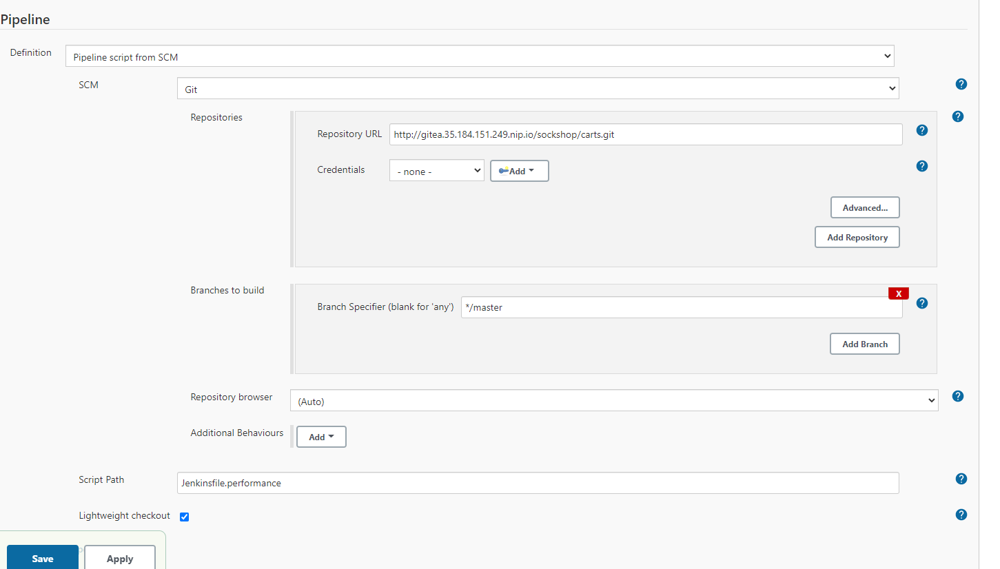

# Define Performance Pipeline

In this lab you will build a Jenkins pipeline for implementing the *Performance as a Self-Service* approach for the carts service. The purpose of this pipeline is that a developer can manually trigger it to run a performance test against a service (in the dev environment) and to retrieve an immediate performance test results. This gives fast feedback if recent changes negatively impacted the service and whether this new version would pass the performance test in the CI pipeline.

## Step 1: Replace `Jenkinsfile.performance`
1. In the `carts` repository, copy the content of `Jenkinsfile.complete.performance`.
1. Replace the content of the `Jenkinsfile.performance` by pasting the content of `Jenkinsfile.complete.performance`.
1. Save and commit `Jenkinsfile.performance`.

## Step 2: Review the Keptn library implementation

Review the pipeline definition file located in the repository `carts/Jenkinsfile.performance`. 

This will import the keptn-library inside the Jenkins pipeline and configure it based on parameters.
```
@Library('keptn-library@3.3')
import sh.keptn.Keptn
def keptn = new sh.keptn.Keptn()
``` 
```
  parameters {
    string(name: 'KEPTN_PROJECT', defaultValue: 'sockshop-perf', description: 'The name of the application.', trim: true)
    string(name: 'KEPTN_SERVICE', defaultValue: 'carts', description: 'The name of the service', trim: true)
    string(name: 'KEPTN_STAGE', defaultValue: 'dev', description: 'The name of the environment.', trim: true)
    string(name: 'KEPTN_MONITORING', defaultValue: 'dynatrace', description: 'Name of monitoring provider.', trim: true)
    string(name: 'KEPTN_DIR', defaultValue: 'keptn/', description: 'keptn shipyard file location', trim: true)
    string(name: 'JMETER_VUCOUNT', defaultValue: '5', description: 'Number of virtual users', trim: true)
    string(name: 'JMETER_LOOPCOUNT', defaultValue: '500', description: 'Number of loops', trim: true)
  }
```
This stage initializes keptn and creates a project in the keptn bridge. 
```
stage('Keptn Init') {
      steps{
        script {
          keptn.keptnInit project:"${KEPTN_PROJECT}", service:"${KEPTN_SERVICE}", stage:"${KEPTN_STAGE}", monitoring:"${KEPTN_MONITORING}", shipyard: "${KEPTN_SHIPYARD}"
          keptn.keptnAddResources("${KEPTN_SLI}",'dynatrace/sli.yaml')
          keptn.keptnAddResources("${KEPTN_SLO}",'slo.yaml')
          keptn.keptnAddResources("${KEPTN_DT_CONF}",'dynatrace/dynatrace.conf.yaml')          
        }
      }
    } // end stage

```
This marks the start of the keptn evaluation

```
keptn.markEvaluationStartTime()

```
and creates an evaluation event in Dynatrace and in the Keptn bridge.

```
   def keptnContext = keptn.sendStartEvaluationEvent starttime:"", endtime:""
          echo "Open Keptns Bridge: ${keptn_bridge}/trace/${keptnContext}"
```
This part of the pipeline executes a jMeter script (as defined by the scriptName) in the context of a jmeter container. The script receives a list of parameters for its configuration. The condition after the *executeJMeter* function terminates the pipeline in case of a failed test.  
```
  container('jmeter') {
    script {
      def status = executeJMeter ( 
        scriptName: "jmeter/${env.APP_NAME}_perfcheck.jmx",
        resultsDir: "PerfCheck_${env.APP_NAME}_${env.VERSION}_${BUILD_NUMBER}",
        serverUrl: "${env.APP_NAME}.dev", 
        serverPort: 80,
        checkPath: '/health',
        vuCount: 10,
        loopCount: 250,
        LTN: "PerfCheck_${BUILD_NUMBER}",
        funcValidation: false,
        avgRtValidation: 2000
      )
      if (status != 0) {
        currentBuild.result = 'FAILED'
        error "Performance check failed."
      }
    }
  }
```

Once the evaluation ends keptn-library will retrieve the results from the keptn api and approve/fail the jenkins pipeline.
```
 def result = keptn.waitForEvaluationDoneEvent setBuildResult:true, waitTime:'5'
 echo "${result}"
```

## Step 3: Review the SLO,SLI definitions

Go to `carts\keptn` folder and review the files that define the SLO. You can find more information about SLO definitions [here](https://keptn.sh/docs/0.7.x/quality_gates/slo/)

```
---
  spec_version: "0.1.1"
  comparison:
    aggregate_function: "avg"
    compare_with: "single_result"
    include_result_with_score: "pass"
  filter:
  objectives:
    - sli: "response_time_p95"
      key_sli: false
      pass:             # pass if (relative change <= 10% AND absolute value is < 200ms)
        - criteria:
            - "<=+10%"  # relative values require a prefixed sign (plus or minus)
            - "<200"    # absolute values only require a logical operator
      warning:          # if the response time is above 200ms and less or equal to 500ms, the result should be a warning
        - criteria:
            - "<=500"  # if the response time is above 500ms, the result should be a failure
      weight: 1         # weight default value is 1 and is used for calculating the score
    - sli: "error_rate"
      pass:
        - criteria:
            - "<=+5%"
            - "<0.5"
      warning:
        - criteria:
            - "<5"
  total_score:
    pass: "90%"
    warning: "75%"
```

Review the files used to define the SLI. You can find more information about Dynatrace SLI definitions using the Metrics V2 API [here](https://www.dynatrace.com/support/help/dynatrace-api/environment-api/metric-v2/)

```
---
spec_version: '1.0'
indicators:
  throughput:          "metricSelector=builtin:service.requestCount.total:merge(0):sum&entitySelector=tag(environment:$STAGE),tag(app:$SERVICE),type(SERVICE)"
  error_rate:          "metricSelector=builtin:service.errors.total.count:merge(0):avg&entitySelector=tag(environment:$STAGE),tag(app:$SERVICE),type(SERVICE)"
  response_time_p50:   "metricSelector=builtin:service.response.time:merge(0):percentile(50)&entitySelector=tag(environment:$STAGE),tag(app:$SERVICE),type(SERVICE)"
  response_time_p90:   "metricSelector=builtin:service.response.time:merge(0):percentile(90)&entitySelector=tag(environment:$STAGE),tag(app:$SERVICE),type(SERVICE)"
  response_time_p95:   "metricSelector=builtin:service.response.time:merge(0):percentile(95)&entitySelector=tag(environment:$STAGE),tag(app:$SERVICE),type(SERVICE)"

```


## Step 5: Validate the Performance Pipeline configuration for Carts
1. Go to  **Jenkins** and click on the **sockshop** folder.
1. Click on `carts.performance`.
1. Click on **Configure**.
1. At *Branch Sources* check if the link to your Gitea Project Repository is set to your *carts* repository.
1. At *Build Configuration* check if *Script Path* is set to `Jenkinsfile.performance`.
2. Finally, click **Save**.



---

[Previous Step: Write Load Test Script](../05_Write_Load_Test_Script) :arrow_backward: :arrow_forward: [Next Step: Run Performance Tests](../07_Run_Performance_Tests)

:arrow_up_small: [Back to overview](../)
