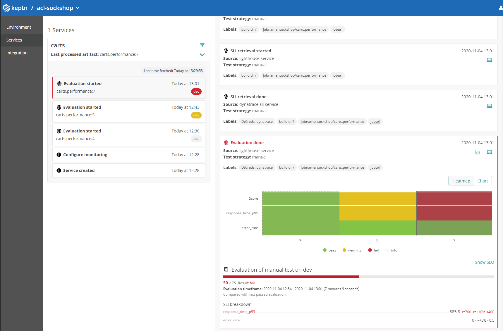

# Analyze results in Keptn Bridge

In this lab you'll learn how to leverage the keptn bridge to analyze the differences between the three performance tests and it's relation to the SLI/SLO definitions.



## Step 1: Go to the keptn bridge

1. Go to the keptn bridge url and login with the username and password as demonstrated in the [Install keptn lab](../01_Install_Keptn).

1. Select the project `acl-sockshop` to visualize the services part of the project using the tof left dropdown.

1. Click on the `carts` service and select the `evaluation started` event.

As you can see, the right panel shows the history for the evaluation event and the evaluation result compared with the previous builds for each SLO defined.

During our first run the 2 SLO objectives were failing with values:

```yaml
- response_time_p95: 258ms (this can be a different value during your run, we will see why by using Dynatrace during the next lab)
- error_rate: 0%
```

During our second run, one 1 of the 2 SLO hit the warning zone set between 400ms to 700ms for the metric response_time_p95.

```yaml
- response_time_p95: 636ms (this can be a different value during your run, we will see why by using Dynatrace during the next lab)
- error_rate: 0%
```

During our third run, the 1 of the 2 SLO hit the failure zone after getting a result over 700ms for the metric response_time_p95.

```yaml
- response_time_p95: 885ms (this can be a different value during your run, we will see why by using Dynatrace during the next lab)
- error_rate: 0%
```

---

[Previous Step: Run Performance Tests](../07_Run_Performance_Tests) :arrow_backward: :arrow_forward: [Next Step: Compare Tests in Dynatrace](../09_Compare_Tests_in_Dynatrace)

:arrow_up_small: [Back to overview](../)