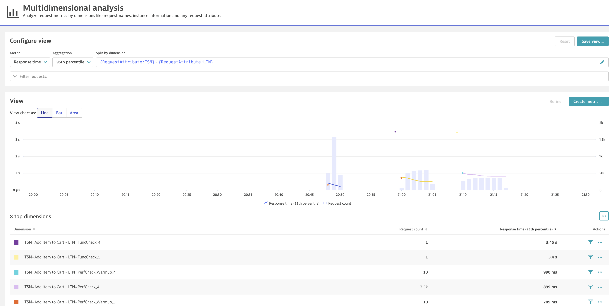

# Compare Tests in Dynatrace

In this lab you'll learn how to leverage Dynatrace to identify the difference between three performance tests. Literally, a couple of clicks can tell you the reason why one build was slower compared to another one. 

## Step 1: Locate the carts service 
1. In Dynatrace go to Transactions and services
1. Click on **Filtered by** and select `Tag:environment:dev`.
1. Select the service ItemsController.
1. You should be able to visualize the 3 deployment Events on the bottom right panel.

## Step 2: Analyze the traffic
1. Click on **Response time** on the request panel.
1. On the top bar select the timeframe that allows you to visualize the 3 tests.
1. Click on create analysis view.
1. Set Aggregation 95th percentile
1. Split by dimension `{RequestAttribute:LTN}`

You should get something like this

## Step 3. Open Comparison View
1. Locate the 3 dot menu on the middle right of the screen and open `performance comparison`
1. Use the time filers from above to select the last test timeframe for the left panel and the first test for the right panel. You should get something like this

1. Click on **Compare response time hotspots**

1. Click on **view method hotspots**

1. You should be able to find the root cause of the delay by searching for the method, you can even visualize the function that slowsdown the method.

---

[Previous Step: Analyze Results in Keptn Bridge](../08_Analyze_Results_in_Keptn_Bridge) :arrow_backward::arrow_forward: [Next Step: Retry Performance Test](../10_Retry_Performance_Test)

:arrow_up_small: [Back to overview](../)