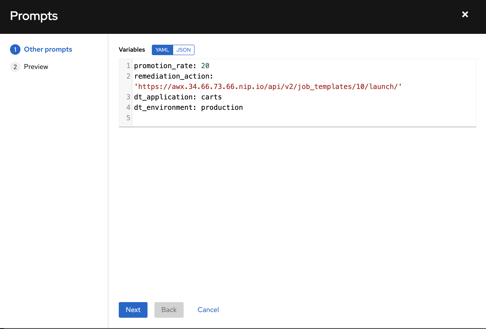

# Run our promotional campaign

In this lab we want to run our promotional campaign in our production environment by applying a change to our configuration of the `carts` service. This service is prepared to allow to add a promotional gift (e.g., Halloween Socks, Christmas Socks, Easter Socks, ...) to a given percentage of user interactions in the `carts` service. 
Therefore, the endpoint `carts/1/items/promotional/` can take as an input a number between 0 and 100 which corresponds to the percentages of user interactions that will receive the promotional gift. E.g., `carts/1/items/promotional/5` will enable it for 5 %, while `carts/1/items/promotional/100` will enable it for 100 % of user interactions. 


## Setup campaign runbook in ansible AWX

The campaign playbook has already been set up in [Deploy ansible AWX](../01_Deploy_Ansible_AWX).

## Run the campaign in our PRODUCTION environment

1. Generate load for the `carts` service
    - Start the [load generator](../scripts/) script by executing the following command:
      ```
      (bastion)$ cd ~
      (bastion)$ ./add-to-cart.sh http://$(kubectl -n production get svc carts -o json | jq -r .status.loadBalancer.ingress[].ip)/carts/1/items
      ```

1. Run the promotional campain
    - Navigate to _Templates_ in ansible AWX
    - Click on the "rocket" icon (🚀) next to your _start campaign_ job template
    
    - Adjust the values accordingly for you promotional campaign:
      - Set the value for `promotion_rate: '20'` to allow for 20 % of the user interactions to receive the promotional gift
      - Do not change the `remediation_action`
      
    - Click _Next_
    - Click _Launch_


1. Verify the update in the `carts` service in Dynatrace: navigate to the `carts` service in your Dynatrace tenant and verify the configuration change that has been applied and sent to Dynatrace.
    

1. Experience an increase of the failure rate: you will experience an increase of the failure rate of the `ItemController` in Dynatrace once you enable the promotional campaign. 
    

1. Dynatrace will open a problem ticket for the increase of the failure rate. Since we have setup the problem notification with ansible AWX, the according `remediation` playbook will be executed once Dynatrace sends out the notification.

1. Verify executed jobs in ansible AWX:
    Navigate to "Jobs" and verify that ansible AWX has executed two jobs. The first job - `remediation` was called since Dynatrace sent out the problem notification to ansible AWX. This job was then executing the remediation tasks which include the execution of the remediation action that is defined in the custom configuration event of the impacted entities (the `carts` service). Therefore, you will also see the `stop-campaign` that was executed.

    

1. Verify the change in the configuration in Dynatrace: to fully verify that the remedation was executed, you will find evidence in Dynatrace.
    - New configuration event that set the promotion rate back to 0 %:
    

    - Comment on the Dynatrace problem ticket that the playbook has been executed:
    

1. Finished! :)

1. (optional) Use Dynatrace to find the corresponding Java class as well as the exact line number that was responsible for the increase of the failure rate to be able to fix the issue and prevent it to happen again for future campaigns.

---

[Previous Step: Setup Dynatrace](../03_Setup_Dynatrace) :arrow_backward:

:arrow_up_small: [Back to overview](../)
