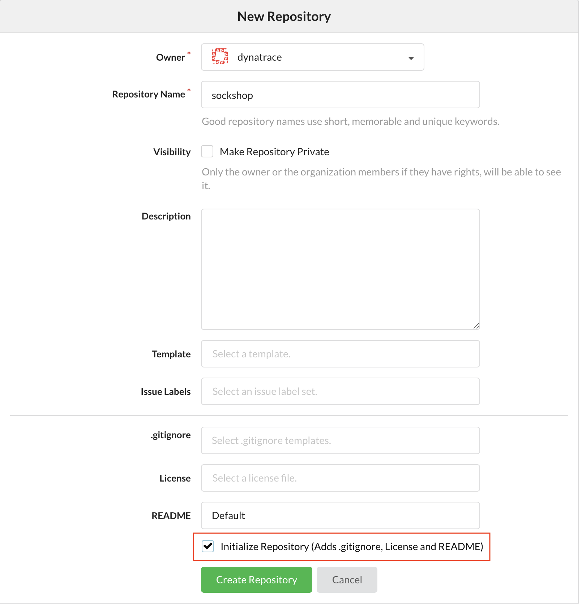

# Preparation for keptn

Before we can install keptn and deploy an application with it, there are a couple of steps we have to take

## Step 1: Create a new Gitea repository in your dynatrace org for keptn

We will need to create a new repo in your Gitea dynatrace org for the project we will create in keptn. The name should be `sockshop`. Make sure to initialiaze this repo with a README. 

## Step 2: Sign up for a ServiceNow developer Account and request a free dev instance

Go to https://developer.servicenow.com/ and register for a new account.
Once your account has been created and you have signed in to the developer portal, click on `Manage` at the top of the screen. Here you can request your free developer instance.

Sign up for a `Orlando` or `Paris` release instance on the [ServiceNow Developer Portal](https://developer.servicenow.com/)

---

:arrow_forward: [Next Step: Reinstall Keptn](../01_Reinstall_keptn)

:arrow_up_small: [Back to overview](../)