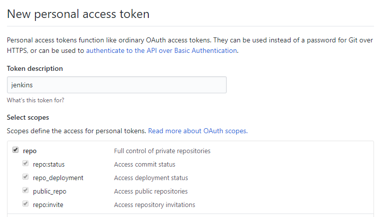

# Create a new Github Personal Access Tokens

In various parts of the ACL we will be interacting with Github. One way of authenticating with Github is by providing your password to the scripts. However that will not work if you have enabled MFA (Multi-Factor Authentication) and also poses certain security risks. For that reason we will be generating a Personal Access Token (aka PAT) that we can use to only interact with our organizations and repositories.

## Data needed
* GitHub user and email address and password

## Steps

1. Visit [Personal Access token](https://github.com/settings/tokens/new)
1. The name you provide is not important, however make it recognizable so you can also lateron easily disable the token. A good suggestion would be acl-token
1. Ensure that the token has `Full control of private repositories` (see the screenshot below)
    
1. Click on `Generate token` and copy the value. **This value is only visible now so ensure you copy it otherwise a new token must be generated**

---

:arrow_up_small: [Back to overview](README.md)