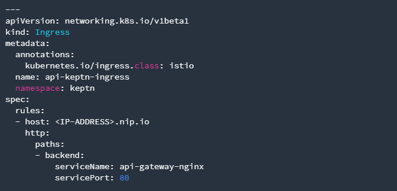
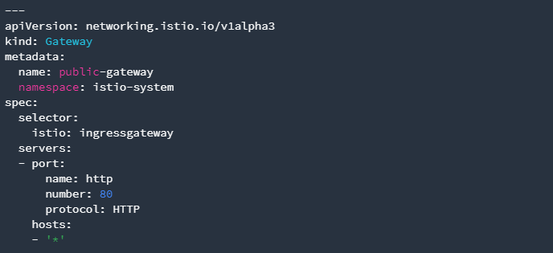

# Configure Istio

In this lab you'll configure Istio to work with Keptn.

## Step 1: Configure Istio

1. The first step for our configuration automation for Istio is downloading the configuration bash script from Github:
    ```bash
    (bastion)$ curl -o configure-istio.sh https://raw.githubusercontent.com/keptn/examples/release-0.7.1/istio-configuration/configure-istio.sh
    ```
2. After that you need to make the file executable using the chmod command.
    ```bash
    (bastion)$ chmod +x configure-istio.sh
    ```
3. Finally, let's run the configuration script to automatically create your Ingress resources.
    ```bash
    (bastion)$ ./configure-istio.sh
    ```
#### What is actually created
With this script, you have created an Ingress based on the following manifest.

Besides, the script has created a gateway resource for you so that the onboarded services are also available publicly.



---
