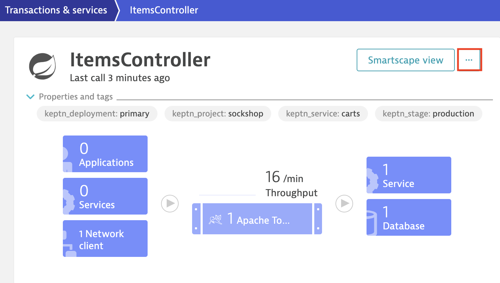
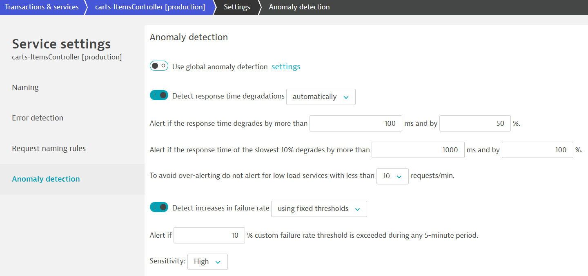

# Self-healing with Feature Flags

In this tutorial, you will learn how to use the capabilities of Keptn to provide self-healing for an application with feature flags based on the Unleash feature toggle framework. Please note that within this tutorial we use the carts microservice (see prerequesits below) which is already prepared to work with feature toggles.

## Prerequisites

- Finish the [Onboarding a Service] lab
- Finish [Configure Monitoring] lab
- Double-check that you have disabled frequent issue detection in Dynatrace.

## Adjust anomaly detection in Dynatrace

The Dynatrace platform is built on top of AI, which is great for production use cases, but for this demo we have to override some default settings in order for Dynatrace to trigger the problem.

1. Refer to steps 1 and 2 on [Simulate user traffic](#simulate-user-traffic) in the case that the `ItemsController` service in production does not appear on dynatrace

1. Navigate to Transaction & services and find the service ItemsController in the sockshop-production environment.

    

1. In the section Anomaly detection override the global anomaly detection and set the value for the failure rate to use fixed thresholds and to alert if 10% custom failure rate are exceeded. Finally, set the Sensitiviy to High.

    

## Onboard and deploy the Unleash server

To quickly get an Unleash server up and running with Keptn, follow these instructions:

1. Make sure you are in the correct folder of your examples directory:

    ```bash
    (bastion)$ cd ~/examples/unleash-server
    ```

1. Create a new project using the keptn create project command:`

    ```bash
    (bastion)$ keptn create project unleash --shipyard=./shipyard.yaml
    ```

1. Onboard unleash and unleash-db using the keptn onboard service command:

    ```bash 
    (bastion)$ keptn onboard service unleash-db --project=unleash --chart=./unleash-db
    (bastion)$ keptn onboard service unleash --project=unleash --chart=./unleash
    ```

1. Send new artifacts for unleash and unleash-db using the keptn send new-artifact command:

    ```bash
    (bastion)$ keptn send event new-artifact --project=unleash --service=unleash-db --image=postgres:10.4
    (bastion)$ keptn send event new-artifact --project=unleash --service=unleash --image=docker.io/keptnexamples/unleash:1.0.0
    ```

1. Get the URL (unleash.unleash-dev.x.x.x.x.nip.io):

    ```bash 
    (bastion)$ echo http://unleash.unleash-dev.$(kubectl -n keptn get ingress api-keptn-ingress -ojsonpath='{.spec.rules[0].host}')
    ```

1. Open the URL in your browser and log in using the following credentials:

- Username: keptn
- Password: keptn

## Configure the Unleash server

In this tutorial, we are going to introduce feature toggles for two scenarios:

1. Feature flag for a very simple caching mechanism that can speed up the delivery of the website since it skips the calls to the database but instead replies with static content.
1. Feature flag for a promotional campaign that can be enabled whenever you want to run a promotional campaign on top of your shopping cart.

To set up both feature flags, navigate to your Unleash server and log in.

1. Click on the red + to add a new feature toggle.

    

1. Name the feature toggle EnableItemCache and add carts in the description field.

    

1. Create another feature toggle by following the same procedure and by naming it the feature toggle EnablePromotion and by adding carts in the description field.

    

### Configure Keptn

Now, everything is set up in the Unleash server. For Keptn to be able to connect to the Unleash server, we have to add a secret with the Unleash API URL as well as the Unleash tokens.

1. In order for Keptn to be able to use the Unleash API, we need to add the credentials as a secret to our Keptn namespace. In this tutorial, we do not have to change the values for UNLEASH_SERVER, UNLEASH_USER, and UNLEASH_TOKEN, but in your own custom scenario this might be needed to change it to your actual Unleash URL, user and token. As said, in this tutorial we can use the following command as it is:

    ```bash
    (bastion)$ kubectl -n keptn create secret generic unleash --from-literal="UNLEASH_SERVER_URL=http://unleash.unleash-dev/api" --from-literal="UNLEASH_USER=keptn" --from-literal="UNLEASH_TOKEN=keptn"
    ```

1. Keptn has to be aware of the new secret to connect to the Unleash server and to set the feature toggles. Therefore, the remediation-service must be restarted:

    ```bash
    (bastion)$ kubectl delete pod -l=run=remediation-service -n keptn
    ```
1. Install the Unleash action provider which is responsible for acting upon an alert, thus it is the part that will actually resolve issues by changing the stage of the feature flags.
    ```bash
    (bastion)$ kubectl apply -f https://raw.githubusercontent.com/keptn-contrib/unleash-service/release-0.1.0/deploy/service.yaml
    ```

2. Finally, switch to the carts example (cd examples/onboarding-carts) and verify the contents of remediation_feature_toggle.yaml which should look like:

    ```bash
    apiVersion: spec.keptn.sh/0.1.4
    kind: Remediation
    metadata:
    name: carts-remediation
    spec:
    remediations:
        - problemType: Response time degradation
        actionsOnOpen:
            - action: toggle-feature
            name: Toogle feature flag
            description: Toogle feature flag EnableItemCache to ON
            value:
                EnableItemCache: "on"
        - problemType: Failure rate increase
        actionsOnOpen:
            - action: toggle-feature
            name: Toogle feature flag
            description: Toogle feature flag EnablePromotion to OFF
            value:
                EnablePromotion: "off"
    ```

    now add the resource, using the commands:

    ```bash
    (bastion)$ cd ~/examples/onboarding-carts
    (bastion)$ keptn add-resource --project=sockshop --service=carts --stage=production --resource=remediation_feature_toggle.yaml --resourceUri=remediation.yaml
    ```

    **Note:** The file describes remediation actions (e.g., featuretoggle) in response to problems/alerts (e.g., Response time degradation) that are sent to Keptn.

### Simulate user traffic

To simulate user traffic, we are going to execute the following script that will constantly add items to the shopping cart.

1. Change into the folder with the load generation program within the examples repo:

    ```bash
    (bastion)$ cd ~/examples/load-generation/bin
    ```

1. Start the according load generation program depending on your operating system (replace *OS with either linux, mac or win):

    ```bash
    (bastion)$ ./loadgenerator-linux http://carts.sockshop-production.$(kubectl -n keptn get ingress api-keptn-ingress -ojsonpath='{.spec.rules[0].host}')
    ```

1. Now, go back to your Unleash server in your browser. In this tutorial, we are going to turn on the promotional campaign, which purpose is to add promotional gifts to about 30 % of the user interactions that put items in their shopping cart.

1. Click on the toggle next to EnablePromotion to enable this feature flag.

    

1. By enabling this feature flag, a not implemented function is called resulting in a NotImplementedFunction error in the source code and a failed response. After a couple of minutes, dynatrace will detect an increase in the failure rate and will send out a problem notification to Keptn.

1. Keptn will receive the problem notification/alert and look for a remediation action that matches this problem. Since we have added the remediation.yaml before, Keptn will find a remediation action and will trigger the corresponding action that will disable the feature flag.

1. Finally, take a look into the Keptn’s Bridge to see that an open problem has been resolved:
    

---

[Previous Step: Quality Gates](../05_Quality_Gates) :arrow_backward: :arrow_forward: [Next Step: Runbook Automation](../07_Runbook_Automation)

:arrow_up_small: [Back to overview](../)

[Onboarding a Service]: ../03_Onboard_Service/README.md
[Configure Monitoring]: ../02_Configure_Monitoring/README.md